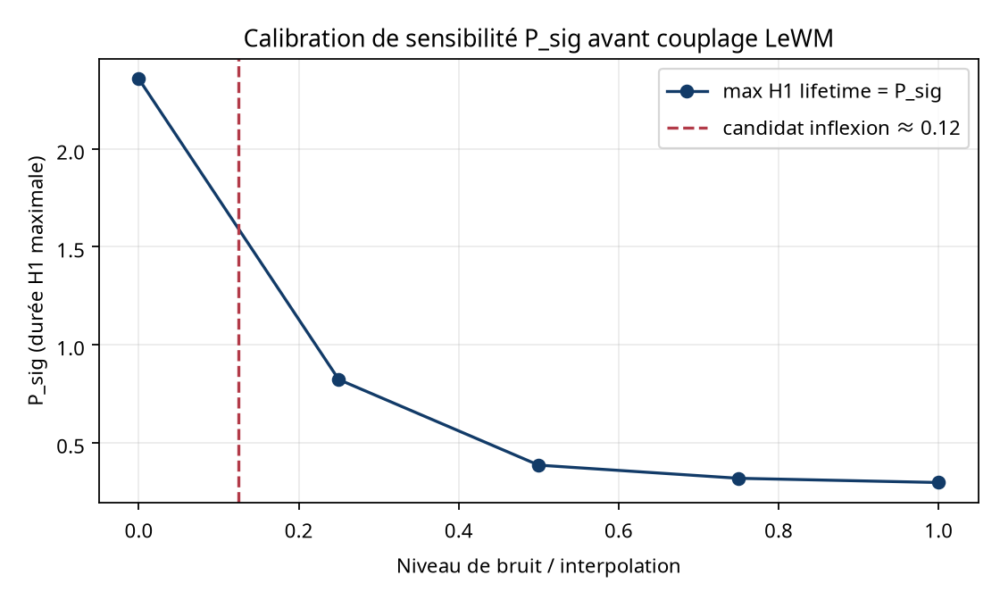

# Calibration de sensibilité P_sig

## Protocole

Nuage déterministe de 96 points : interpolation entre une boucle périodique et un nuage gaussien avec graine 42. Cinq niveaux sont mesurés : 0, 0,25, 0,50, 0,75 et 1,00. Le comptage brut H1 est conservé pour diagnostic, mais la décision utilise la durée maximale de vie H1 et un comptage robuste des barres dépassant 15 % de cette durée maximale.

## Résultats

| Bruit | P_sig max lifetime | H1 brut | H1 persistant robuste |
|---:|---:|---:|---:|
| 0.00 | 2.356946 | 1 | 1 |
| 0.25 | 0.822782 | 15 | 2 |
| 0.50 | 0.385891 | 22 | 9 |
| 0.75 | 0.318820 | 19 | 12 |
| 1.00 | 0.297216 | 21 | 16 |

Le candidat d’inflexion discret est environ **0.12**, défini par la plus forte baisse entre deux niveaux adjacents. Ce point est un seuil de calibration à confirmer sur des embeddings LeWM réels ; il ne doit pas encore être injecté comme seuil permanent.

## Décision

Ne pas lancer le test A/B LeWM avant inspection de la courbe et validation du seuil sur des embeddings réels. Le plugin doit utiliser la persistance des barres plutôt que le nombre H1 brut, qui est sensible aux petits cycles de bruit.
